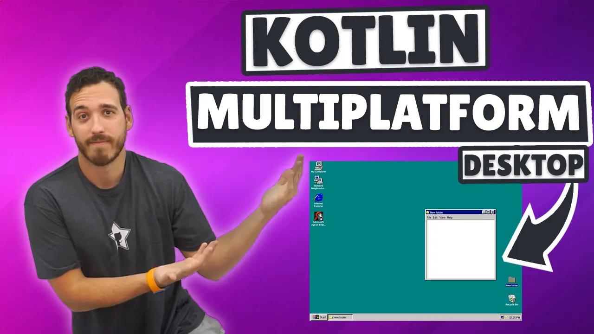
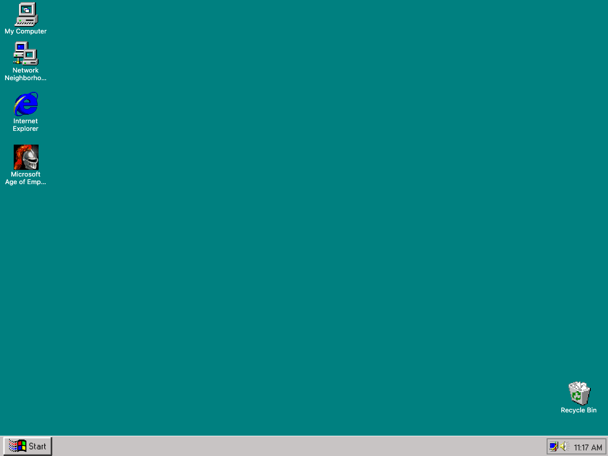
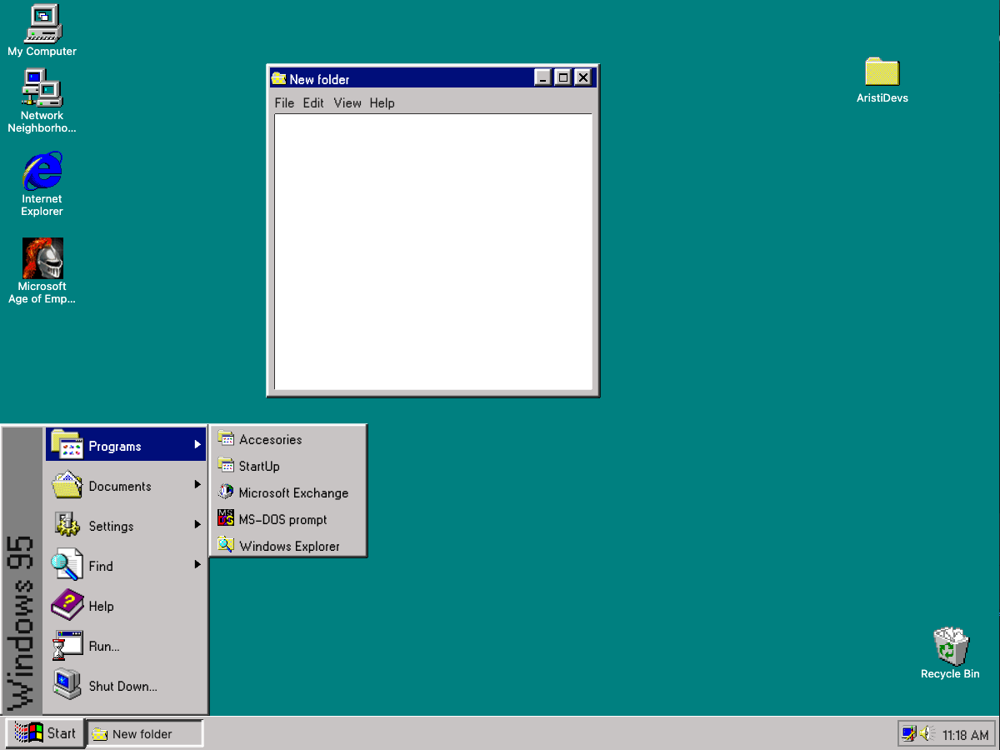
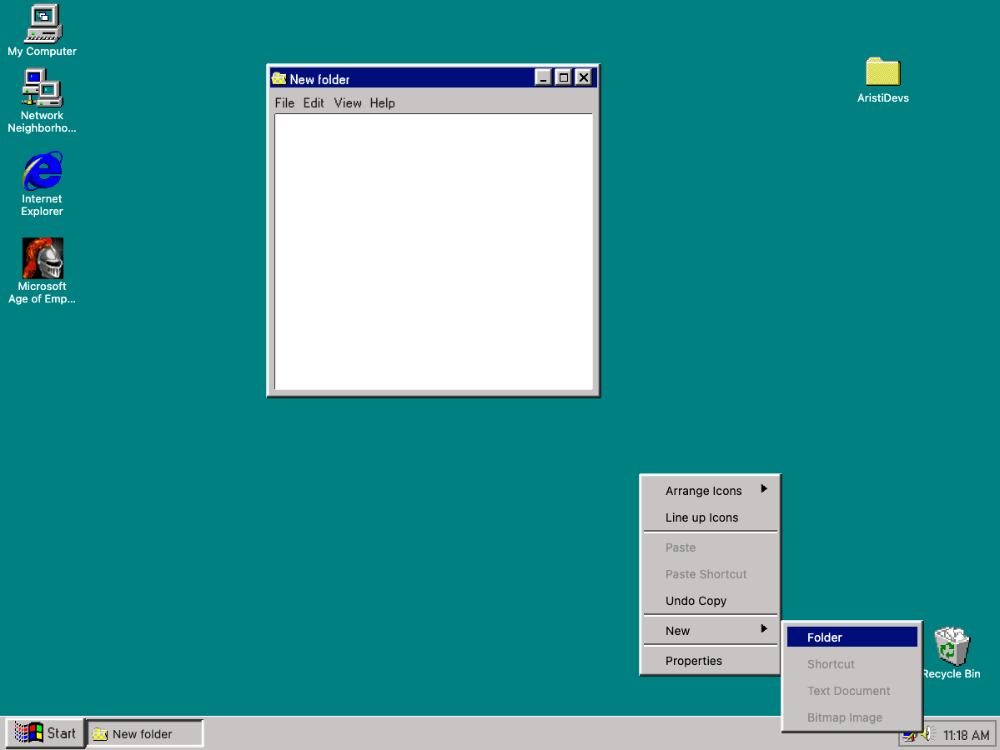

> [!NOTE]  
> 🌐 This README is also available in [English](README.en.md).

# Curso Kotlin Multiplatform - Windows 95

Este proyecto es una implementación con Kotlin Multiplatform (KMP) del icónico Windows 95. Combina prácticas modernas de desarrollo con una interfaz nostálgica.

<p align="center">
<a href="https://youtu.be/QFPTUwFW9p8"></center></a></p>

<p align="center">     </p>

----------

## Aprende a PROGRAMAR aplicaciones en Kotlin Multiplataforma.

Temario: 
<br />
- [Capítulo 1 - Configuración del proyecto](https://www.youtube.com/watch?v=QFPTUwFW9p8&t=160s)
- [Capítulo 2 - Preparando el Splash](https://www.youtube.com/watch?v=QFPTUwFW9p8&t=545s)
- [Capítulo 3 - Tipografía](https://www.youtube.com/watch?v=QFPTUwFW9p8&t=1585s)
- [Capítulo 4 - Windows Bar](https://www.youtube.com/watch?v=QFPTUwFW9p8&t=1865s)
- [Capítulo 5 - Menú inferior](https://www.youtube.com/watch?v=QFPTUwFW9p8&t=4354s)
- [Capítulo 6 - Carpetas](https://www.youtube.com/watch?v=QFPTUwFW9p8&t=7936s)
- [Capítulo 7 - Ventanas](https://www.youtube.com/watch?v=QFPTUwFW9p8&t=10250s)
- [Capítulo 8 - PopUp](https://www.youtube.com/watch?v=QFPTUwFW9p8&t=15252s)
- [Capítulo 9 - Ordenar carpetas](https://www.youtube.com/watch?v=QFPTUwFW9p8&t=18706s)
- [Capítulo 10 - Retoques finales](https://www.youtube.com/watch?v=QFPTUwFW9p8&t=19566s)


----------

## 🛠 Instalación

### Requisitos

-   **Kotlin 2.0.21+**
-   **Compose Multiplatform 1.7.0+**
-   **IDE compatible con KMP**: Fleet o Android Studio.
-   Conocimientos básicos de Kotlin y KMP.

### Configuración

1.  Clona este repositorio:

    ```bash
    git clone https://github.com/ArisGuimera/kmp-windows95.git
    
    ```

2.  Abre el proyecto en Android Studio o Fleet.
3.  Sincroniza el proyecto Gradle para descargar las dependencias.

## Imágenes del proyecto.

|                               Pantalla principal                               | 
|:------------------------------------------------------------------------------:|
|    | 

|                               Menú inferior                               | 
|:------------------------------------------------------------------------------:|
|    | 

|                               Click derecho                               | 
|:------------------------------------------------------------------------------:|
|    | 

----------

## ✏️ Estructura del proyecto

### Componentes

Puedes acceder a `ComposeApp/src/desktopMain/kotlin/com/aristidevs/myWindows95/components` para acceder a todos los componentes que se han ido creando durante el curso. Se han programado lo más genéricos posibles para poder personalizarlos y reutilizarlos en cualquier lugar. Por ejemplo **WindowsButton**

```kotlin
WindowsButton(){
    Text("Ejemplo básico")
}

WindowsButton(Modifier.height(60.dp), onClick = {print("Example"}, dotPadding = 6.dp)){
    //Cualquier vista
}

```

### Helpers

Desde `ComposeApp/src/desktopMain/kotlin/com/aristidevs/myWindows95/helper` dispones del `SoundManager`, el encargado de reproducir la música del splash.

### Extensions

En `ComposeApp/src/desktopMain/kotlin/com/aristidevs/myWindows95/extensions` tendrás todas las funciones de extensión generadas para el proyecto. 

```kotlin

Modifier.onRightClick {}

Modifier.clickableWithoutRipple {}

Modifier.rotateVertically()

//Entre otras

```

### Model

Todos los modelos de datos se encuentran en `ComposeApp/src/desktopMain/kotlin/com/aristidevs/myWindows95/model`.

### Model

Todos los modelos de datos se encuentran en `ComposeApp/src/desktopMain/kotlin/com/aristidevs/myWindows95/model`.

### Splash Screen

Primera vista del proyecto que se lanzará siempre que se ejecute la app. `ComposeApp/src/desktopMain/kotlin/com/aristidevs/myWindows95/splash/`.

### Windows 95

Vista principal del proyecto `ComposeApp/src/desktopMain/kotlin/com/aristidevs/myWindows95/windows95`.


## 🌍 Plataformas Soportadas

-   **Windows**
-   **MacOS**
-   **Linux**

----------

## 🤝 Contribuir

Si quieres apoyar mi trabajo puedes hacerlo a través de los siguientes medios:

- Dale a FAV al proyecto (Star)
- Comparte el [tuit original]() para que llegue a más gente
- Sígueme en mis [redes sociales](https://aristi.dev)

¡Toda ayuda es bienvenida y me permite seguir creando contenido y proyectos open source!

----------

## 👨‍💻 Autor

Desarrollado por **AristiDevs**.

-   [YouTube](https://www.youtube.com/@ArisGuimera)
-   [Twitter](https://twitter.com/ArisGuimera)
-   [LinkedIn](https://www.linkedin.com/in/arisguimera/)

----------

## 🚀 AppCademy.dev


<p align="center">
<a href="https://appcademy.dev"></center></a></p>

Este curso está patrocinado por [AppCademy.dev](https://appcademy.dev) mi plataforma de cursos premium donde no solo aprendemos tecnologías sino que profundizamos en sus desarrollos a través de buenas prácticas y contenido avanzado.

----------

## 📦 Otros Proyectos

Si te gustó este proyecto, no olvides echar un vistazo a otros repositorios:

<table>
<tr>
<td width="50%">
<h3 align="center">Curso Android Básico</h3>
<div align="center">
<a href="https://github.com/ArisGuimera/Android-Expert" target="_blank"></a>
<p>
<a href="https://github.com/ArisGuimera/Android-Expert" target="_blank">

</a>
<a href="https://youtu.be/vJapzH_46a8" target="_blank">

</a>
</p>
<p>Aprende a programar aplicaciones <strong>Android con Kotlin desde cero</strong> - En este curso aprenderás todo lo necesario ya que no es necesario ningún conocimiento previo. Curso <strong>GRATUITO de 12 horas</strong> con todo el código disponible para descargar.</p>
</div>
                                                                                      
</td>

<td width="50%">
               <br>
<h3 align="center">Arquitectura MVVM</h3>
<div align="center">                                       
<a href="https://github.com/ArisGuimera/SimpleAndroidMVVM" target="_blank"></a>
<br>
<p>
<a href="https://github.com/ArisGuimera/SimpleAndroidMVVM" target="_blank">

</a>
<a href="https://youtu.be/hhhSMXi0R3E" target="_blank">

</a>
</p>
</p>Las arquitecturas son <strong>IMPRESCINDIBLES</strong> para poder trabajar como desarrollador/a Android. En este curso, divido por ramas irás aprendiendo a implementar una arquitectura real y robusta con inyección de dependencias, clean architecture, testing y mucho más.</p>
</div>                                                             
</table>                                                                                 
</div>
<br>

<table>
<tr>
<td width="50%">
<h3 align="center">Curso Android Intermedio</h3>
<div align="center">
<a href="https://github.com/ArisGuimera/Android-Expert-Intermedio" target="_blank"></a>
<p>
<a href="https://github.com/ArisGuimera/Android-Expert-Intermedio" target="_blank">

</a>
<a href="https://youtu.be/UaR7GSNACsM" target="_blank">

</a>
</p>
<p>Aprende a programar aplicaciones <strong>Android con Kotlin nivel intermedio</strong> - En este curso nos centraremos en las <strong>buenas prácticas, arquitectura y testing</strong>. Curso <strong>GRATUITO de 8 horas</strong> con todo el código disponible para descargar.</p>
</div>
                                                                                      
</td>       

<td width="50%">
<h3 align="center">Curso Kotlin Multiplatform</h3>
<div align="center">
<a href="https://github.com/ArisGuimera/Curso-Kotlin-Multiplatform" target="_blank"></a>
<p>
<a href="https://github.com/ArisGuimera/Curso-Kotlin-Multiplatform" target="_blank">

</a>
<a href="https://youtube.com/playlist?list=PL8ie04dqq7_NUvBcMMosVRAbqZDWmRzX3&si=FdS-Z07ZFAUjDHAE" target="_blank">

</a>
</p>
<p>Aprende a programar aplicaciones <strong>multiplataform con Kotlin y Jetpack Compose</strong> - En este curso nos centraremos en dominar Kotlin Multiplatform <strong>desde cero</strong>. Curso <strong>GRATUITO</strong> (en desarrollo) con todo el código disponible para descargar.</p>
</div>
                                                                                      
</td>  
</table>                                                                                 
</div>
<br>
